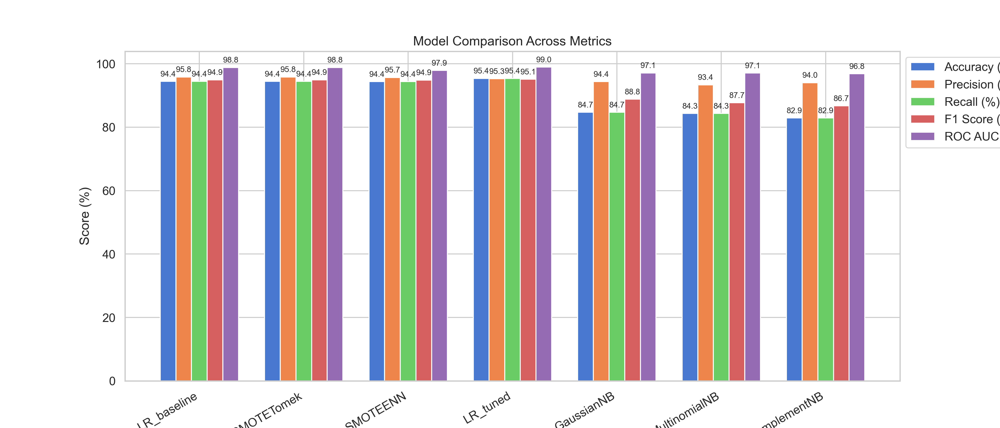

# Intrusion Detection System in Wireless Sensor Networks (IDS-WSN)

This repository contains the implementation and evaluation of an Intrusion Detection System (IDS) for Wireless Sensor Networks (WSNs), using a variety of machine learning techniques and data‐driven preprocessing steps to accurately detect different attack types.

---

## Table of Contents

1. [Project Overview](#project-overview)
2. [Dataset](#dataset)
3. [Project Structure](#project-structure)
4. [Environment Setup](#environment-setup)
5. [Installation](#installation)
6. [Usage](#usage)
7. [Implemented Pipeline](#implemented-pipeline)

   * Data Preprocessing
   * Exploratory Data Analysis (EDA)
   * Feature Engineering & Selection
   * Handling Class Imbalance
   * Model Implementation & Tuning
   * Model Comparison & Selection
8. [Results & Comparison](#results--comparison)
9. [Contributing](#contributing)
10. [License](#license)

---

## Project Overview

Wireless Sensor Networks (WSNs) are vulnerable to a variety of network‐level attacks (e.g., Blackhole, Grayhole, Flooding, TDMA). This project implements a robust IDS framework that:

* Ingests the WSN dataset from Kaggle
* Applies thorough data preprocessing and feature engineering
* Utilizes techniques such as SMOTE and SMOTE‐ENN to address class imbalance
* Trains and evaluates multiple classifiers (Logistic Regression variants, GaussianNB, MultinomialNB, ComplementNB)
* Compares performance using Accuracy, Precision, Recall, F1‐Score, and ROC‐AUC metrics

## Dataset

* **Source:** [WSN-DS on Kaggle](https://www.kaggle.com/datasets/bassamkasasbeh1/wsnds)
* **Files:**

  * `train.csv` (features + label)
  * `test.csv` (features + id)

## Project Structure

```plaintext
├── data
│   ├── train.csv
│   └── test.csv
├── notebooks
│   └── ids-in-wsn.ipynb      # Jupyter notebook
├── images
│   └── model_comparison.png  # Performance comparison graph
├── requirements.txt          # Python dependencies
└── README.md                 # Project documentation
```

## Environment Setup

1. **Python Version:** ≥ 3.8
2. **Virtual Environment (recommended):**

   ```bash
   python3 -m venv venv
   source venv/bin/activate  # Linux/macOS
   venv\Scripts\activate     # Windows
   ```

## Installation

1. Clone the repository:

   ```bash
   git clone https://github.com/Kaleemullah-Younas/Intrusion-Detection-System-in-wsn.git
   cd Intrusion-Detection-System-in-wsn
   ```

2. Install required packages:

   ```bash
   pip install -r requirements.txt
   ```

## Usage

1. **Run the Jupyter Notebook:**

   ```bash
   jupyter notebook notebooks/ids-in-wsn.ipynb
   ```

2. **Generate the Comparison Graph:**

   * Within the notebook, execute the cell under “Model Comparison & ROC Curve” to regenerate `plots/model_comparison_metrics_percent.png`.

3. **Evaluate on Test Set:**

   ```bash
   python notebooks/ids-in-wsn.ipynb  # or export as script and run
   ```

## Implemented Pipeline

### 1. Data Preprocessing

* Loaded dataset and checked shape, data types, descriptive statistics
* Handled missing and duplicate values
* Encoded categorical labels

### 2. Exploratory Data Analysis (EDA)

* **Univariate, Bivariate & Multivariate Analysis**
* Visualized distributions and pairwise correlations

### 3. Feature Engineering & Selection

* Dropped highly correlated features (|corr| > 0.9)
* Applied `MinMaxScaler` to normalize numeric features
* VarianceThreshold (threshold=0.01) to remove low‐variance features
* `SelectKBest` (ANOVA‐F) and `RFE` with Logistic Regression to select top 10 features

### 4. Handling Class Imbalance

* Compared techniques: SMOTE, SMOTE‐Tomek, SMOTE‐ENN
* Balanced each class to 20% of the dataset

### 5. Model Implementation & Tuning

* **Logistic Regression Variants:** Baseline, SMOTE‐Tuned (GridSearch over C ∈ {0.01,0.1,1,10})
* **Naive Bayes:** GaussianNB, MultinomialNB, ComplementNB

### 6. Model Comparison & Selection

* Evaluated on Accuracy, Precision, Recall, F1‐Score, ROC‐AUC
* Selected **LR\_tuned** for highest F1 & AUC, and **GaussianNB** for lightweight deployment

## Results & Comparison

Below is the performance comparison of the implemented models:



* **LR\_tuned:** Highest overall F1‐Score and ROC‐AUC
* **GaussianNB:** Fast inference, strong probabilistic performance

## Contributing

Contributions, issues, and feature requests are welcome! Please follow these steps:

1. Fork this repository
2. Create your feature branch: `git checkout -b feature/YourFeature`
3. Commit your changes: `git commit -m 'Add YourFeature'`
4. Push to the branch: `git push origin feature/YourFeature`
5. Submit a pull request

## License

This project is licensed under the MIT License.
